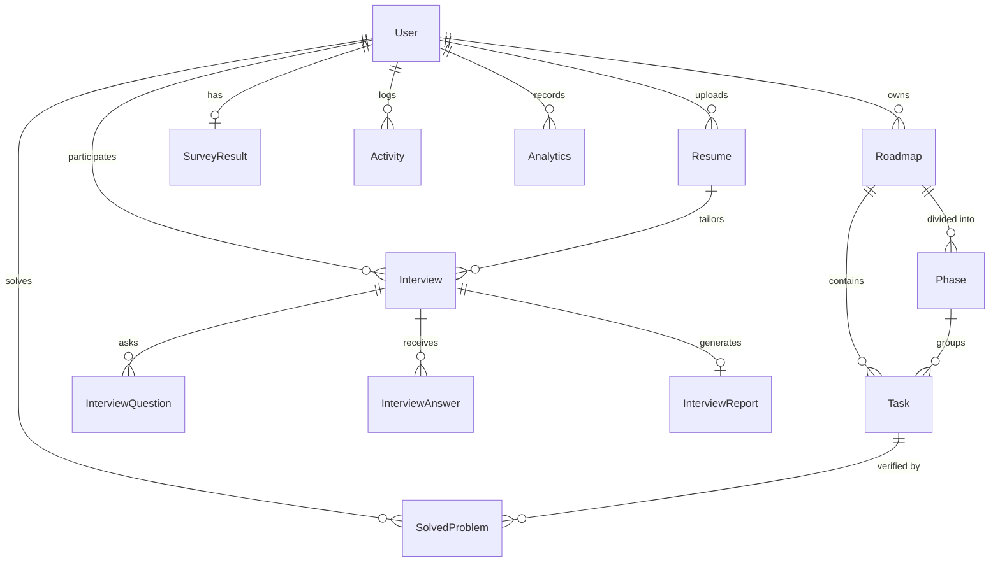
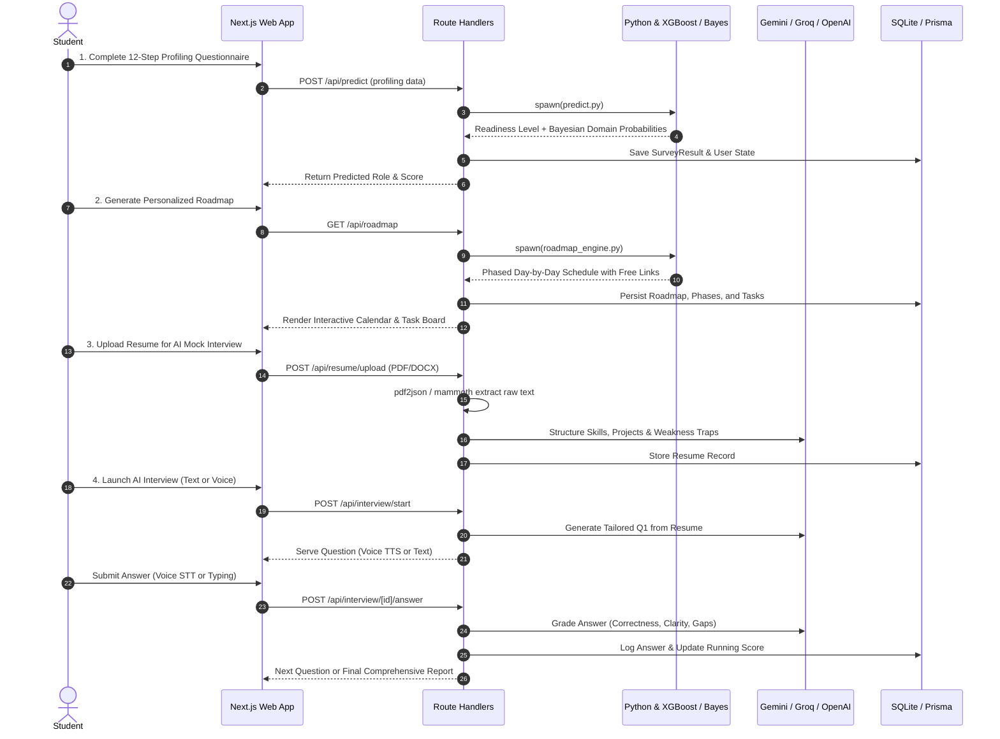

# 🎓 PlacExpert AI — Complete Project & Technology Overview

> **Presentation & Viva Defense Master Sheet**  
> *Everything you need to know about the architectures, tools, models, algorithms, libraries, APIs, and features running in PlacExpert AI.*

---

## 📌 Executive Summary (What is PlacExpert AI?)

**PlacExpert AI** is an end-to-end, AI-powered career counseling, skill assessment, and placement preparation platform engineered for engineering students. It bridges the gap between campus academics and industry expectations by providing:
1. **Intelligent Student Profiling** (Academic & skill diagnosis).
2. **Machine Learning Readiness Prediction** (Benchmarked ML classification).
3. **Probabilistic Career Domain Recommendation** (Bayesian inference).
4. **Automated Dynamic Roadmap Generation** (Scaled to student timeline & weak areas).
5. **AI & Voice Mock Interviews** (Resume-aware dynamic Q&A + LLM semantic grading).
6. **Resume Parsing & Skill Extraction** (PDF/DOCX structured intelligence).
7. **Verification & Gamified Learning Analytics** (Quiz-gating, LeetCode logging, consecutive streaks).

---

## 🏗️ 1. Complete Technology Stack & Tools

### A. Frontend Layer
| Technology / Library | Version | Role & Usage in Project |
|---|---|---|
| **Next.js** | `16.2.5` | React full-stack framework using App Router, Server Components, and API Route handlers. |
| **React** | `19.2.4` | Modern UI library utilizing hooks, concurrent features, and client/server split architecture. |
| **TypeScript** | `^5` | Strict static type safety across frontend components, database queries, and API payloads. |
| **TailwindCSS** | `^4` (via `@tailwindcss/postcss`) | Utility-first styling engine with customized glassmorphism, responsive grid, and dark mode themes. |
| **Framer Motion** | `^12.38.0` | Fluid UI animations, animated step transitions in profiling, card entries, and modal fades. |
| **Recharts** | `^3.8.1` | Interactive data visualization (readiness radar charts, score history, domain probability graphs). |
| **Lucide React** | `^1.14.0` | Comprehensive iconography for navigation, task statuses, audio controls, and badges. |
| **clsx & tailwind-merge** | `^2.1.1` & `^3.5.0` | Dynamic class construction and safe utility class overriding. |

---

### B. Backend & Database Layer
| Technology / Tool | Version | Role & Usage in Project |
|---|---|---|
| **Next.js Route Handlers** | `16.2.5` | Primary REST API endpoints (`/api/predict`, `/api/roadmap`, `/api/interview`, `/api/resume`, `/api/auth`). |
| **Express.js Backend** | `^5.2.1` | Standalone secondary Node.js backend server (`backend/server.js`) on port 5000 for modular services. |
| **Prisma ORM** | `^6.19.3` | Type-safe database client, schema migrations, and relational query generator. |
| **SQLite Database** | `prisma/dev.db` | High-speed, zero-config relational database storing users, roadmaps, tasks, resumes, and interview transcripts. |
| **Child Process (`spawn`)** | Native Node.js | Subprocess bridge executing Python ML inference scripts from Next.js API routes with JSON I/O pipes. |
| **Axios & CORS** | `^1.18.1` & `^2.8.6` | HTTP communication and cross-origin resource sharing between frontend and backend services. |

---

### C. Resume Parsing & Document Extraction
| Tool / Library | Role & Purpose |
|---|---|
| **`pdf2json`** (`^4.1.0`) | Primary PDF parser extracting character streams, positional text, and raw tokens from candidate resumes. |
| **`pdf-parse`** (`^2.4.5`) | Fallback PDF buffer extractor ensuring 100% upload reliability even with non-standard PDF formats. |
| **`mammoth`** (`^1.12.3`) | DOCX parser converting Microsoft Word resumes into clean, plain-text strings for AI ingestion. |

---

### D. Audio & Voice AI (Browser Native)
| Tool / API | Role & Purpose |
|---|---|
| **Web Speech Recognition API** (`webkitSpeechRecognition`) | Real-time speech-to-text (STT) conversion during voice mock interviews. |
| **Web Speech Synthesis API** (`speechSynthesis`) | Browser-native text-to-speech (TTS) that reads out questions with natural audio playback. |
| **Regex NLP Pattern Matcher** | Detects verbal filler words (`um`, `uh`, `like`, `literally`, `basically`, `you know`) to score communication fluency. |

---

## 🧠 2. Machine Learning, NLP & AI Models

PlacExpert AI employs a **multi-tier hybrid AI architecture**: classical ML for deterministic scoring, Bayesian probability for domains, NLP embeddings for similarity, and Generative LLMs for dynamic interviews.

### 1. XGBoost Classifier (Placement Readiness Level)
- **Files**: `ml/train_readiness.py`, `ml/predict.py`, `ml/models/readiness_model.pkl`, `ml/advanced_analytics.pkl`
- **Goal**: Predicts whether a candidate's readiness level is **Beginner**, **Intermediate**, or **Advanced**.
- **Dataset**: `ml/datasets/student_dataset.csv` (features: `Academic_Year`, `Target_Company`, `DSA_Count`, `Projects`, `Core_CS_Strength`, `Coding_Platform`, `Aptitude`, `Comm_Confidence`, etc.).
- **Benchmarked Models Comparison** (5-Fold Cross Validation & GridSearch):
  | Model | Accuracy | Precision | Recall | F1-Score |
  |---|---|---|---|---|
  | **Decision Tree** | 95.00% | 95.63% | 95.00% | 94.97% |
  | **Random Forest** | 100.00% | 100.00% | 100.00% | 100.00% |
  | **XGBoost (Chosen)** | **100.00%** | **100.00%** | **100.00%** | **100.00%** |
- **Why XGBoost?** Gradient boosting handles categorical encodings smoothly, resists overfitting with L1/L2 regularization, and provides probability distributions (`predict_proba`) for confidence intervals.

---

### 2. Bayesian Inference Engine (Career Domain Recommendation)
- **Files**: `ml/bayesian_recommendation.py`, `ml/models/bayesian_probabilities.json`
- **Algorithm**: Naive Bayes Theorem calculating the posterior probability of candidate fit:
  $$P(\text{Domain} \mid \text{Answers}) \propto P(\text{Domain}) \times \prod_{i=1}^{n} P(\text{Answer}_i \mid \text{Domain})$$
- **Mathematical Details**:
  - Uses logarithmic summation to prevent floating-point underflow:  
    $\log P(\text{Domain} \mid \mathbf{X}) = \log P(\text{Domain}) + \sum \log P(x_i \mid \text{Domain})$
  - Incorporates **Laplace Smoothing** ($\alpha = 0.001$) to prevent zero-probability lockouts for unobserved feature pairs.
  - Normalizes final softmax probabilities to rank top career trajectories: *Full Stack, AI/ML, Data Science, DevOps/Cloud, Cyber Security, Mobile Development, Embedded/IoT*.

---

### 3. Sentence Transformers & NLP Semantic Evaluator
- **Files**: `ml/interview_evaluator.py`
- **Model**: `all-MiniLM-L6-v2` (from the HuggingFace `sentence-transformers` library)
- **Mechanism**:
  - Encodes student answers and expert ground-truth answers into high-dimensional dense vector embeddings ($384$-dimensional vectors).
  - Computes **Cosine Similarity**:
    $$\text{Cosine Similarity} = \frac{\mathbf{u} \cdot \mathbf{v}}{\|\mathbf{u}\| \|\mathbf{v}\|}$$
  - Scales similarity to a 0–10 scoring range.
  - Performs **Key Concept Extraction**: Scans candidate response for core technical terminology (e.g., in DP: "memoization", "optimal substructure", "overlapping subproblems").

---

### 4. Generative AI & Multi-Provider LLM Orchestrator
- **Files**: `src/lib/llm-service.ts`, `src/lib/interview/ai-provider.ts`, `src/lib/interview/question-generator.ts`, `src/lib/interview/answer-evaluator.ts`
- **Supported LLM Providers (Automatic Fallback Chain)**:
  1. **Google Gemini API**: Models `gemini-2.0-flash` & `gemini-1.5-flash` (Structured JSON schema mode).
  2. **Groq Cloud API**: Model `llama-3.3-70b-versatile` (Ultra high-speed open-weights inference).
  3. **OpenAI API**: Model `gpt-4o-mini` (JSON mode).
  4. **Deterministic Local Fallback Engine**: If no API keys are present or network fails, the system falls back to rule-based Q&A datasets (`ai_interview_qa_dataset.csv` & domain rubrics), ensuring zero crashes during live demos!
- **Tasks Performed by LLM**:
  - Deep resume analysis (identifies projects, tech stacks, certifications, experience levels).
  - Contextual question generation based strictly on candidate resume claims.
  - Dynamic follow-up questioning if candidate introduces unfamiliar tech terms not present on their resume.
  - Multi-dimensional answer evaluation (Technical Correctness, Clarity, Completeness, Confidence, Knowledge Gaps).

---

### 5. Weak Area Detection Engine
- **Files**: `ml/weak_area_engine.py`
- **Rule**: Evaluates topic score aggregates across DSA, DBMS, OS, Computer Networks:
  - $\text{Avg} < 3.0 \rightarrow$ **CRITICAL** severity.
  - $\text{Avg} < 5.0 \rightarrow$ **HIGH** severity.
  - $\text{Avg} < 6.5 \rightarrow$ **MEDIUM** priority.
- Dynamically injects remedial study phases and curated revision modules into the student's roadmap.

---

### 6. Adaptive Roadmap Generation Engine
- **Files**: `ml/roadmap_engine.py`, `src/app/api/roadmap/route.ts`
- **Customization Parameters**:
  - User readiness level (*Beginner / Intermediate / Advanced*).
  - Detected weak areas (DSA, DBMS, OS, CN).
  - Target timeline (*1 Month Crash Course, 3 Months Standard, 6 Months In-Depth, 1 Year Master*).
  - Daily available study time (1–2 hrs, 3–4 hrs, 5+ hrs).
- **100% Free Curated Resources**: Maps every task to vetted open platforms: LeetCode (free tier), GeeksforGeeks, CS50 Harvard, freeCodeCamp, The Odin Project, and MIT OpenCourseWare.

---

## 🗄️ 3. Database Architecture (Prisma & SQLite)

The database schema (`prisma/schema.prisma`) comprises 11 interconnected relational tables:

### Table Breakdown:
1. **`User`**: User credentials, target company, academic year, leetcode handle, streak, readiness score.
2. **`Resume`**: Raw uploaded resume text, JSON parsed data, AI-generated strengths & gap analysis.
3. **`Interview`**: Session metadata (Role, Type: Technical/HR/Behavioral, Difficulty, Mode: Text/Voice, Status).
4. **`InterviewQuestion`**: Order index, prompt, difficulty, intent, `isFollowUp` boolean flag.
5. **`InterviewAnswer`**: Transcribed response, multi-rubric scores (relevance, clarity, completeness, duration).
6. **`InterviewReport`**: Post-interview final analytics, radar scores, improvement suggestions, study plan.
7. **`Roadmap`**: Parent preparation plan linked to target role and student timeline.
8. **`Phase`**: Sequential learning milestones (e.g., "Phase 1: Foundations", "Phase 2: Core Data Structures").
9. **`Task`**: Daily actionable learning items with direct links to free educational resources.
10. **`SolvedProblem`**: Proof-of-work records logging solved LeetCode/GFG questions to unlock quizzes.
11. **`SurveyResult`**: Historical snapshot of student profiling answers and predicted probability matrices.

---

## 🚀 4. End-to-End User Journey & Workflow

---

## 🎯 5. Quick-Fire Presentation Cheat Sheet (Q&A Defense)

### Q: Why did you pick XGBoost over Deep Learning or simple Decision Trees?
> **Answer**: Placement readiness classification operates on tabular demographic and skill data. Tree-based ensemble methods—specifically XGBoost—consistently outperform deep neural networks on tabular datasets by preventing overfitting on smaller sample sizes, natively managing sparse categorical features, and executing with sub-10ms inference latency.

### Q: How does the system handle students who haven't decided on a career path?
> **Answer**: We use a Bayesian Inference Engine ($P(\text{Domain} \mid \text{Answers})$) with Laplace smoothing. By evaluating conditional probabilities across their core strengths, coding platform, and projects, the platform calculates an exact probability distribution across 7 domains and recommends their highest likelihood fit.

### Q: What happens if an API key expires or the internet drops during the interview?
> **Answer**: The application includes a multi-tier fallback architecture:
> 1. It attempts Google Gemini (`gemini-2.0-flash`).
> 2. Fails over to Groq (`llama-3.3-70b-versatile`).
> 3. Fails over to OpenAI (`gpt-4o-mini`).
> 4. If all APIs fail or no keys are configured, it seamlessly falls back to our **Sentence Transformers (`all-MiniLM-L6-v2`)** and curated domain answer bank (`ai_interview_qa_dataset.csv`), ensuring zero application downtime.

### Q: How is user progress verified so students don't just click "Complete"?
> **Answer**: Tasks are quiz-gated and problem-gated (`SolvedProblem`). Users submit their LeetCode/code proof links, and completing requisite problems unlocks the knowledge-check quiz before the calendar advances. Streaks are strictly calculated on consecutive active calendar dates.

### Q: What is unique about the Voice Interview module?
> **Answer**: It runs entirely in-browser with zero latency using the HTML5 Web Speech API (`webkitSpeechRecognition` + `SpeechSynthesis`). Beyond transcribing, it evaluates verbal hesitation by regex-tracking verbal filler words (`um`, `uh`, `like`), generating a communication fluency metric alongside technical scoring.

---
*Created for PlacExpert AI Project Presentation & Technical Viva.*
