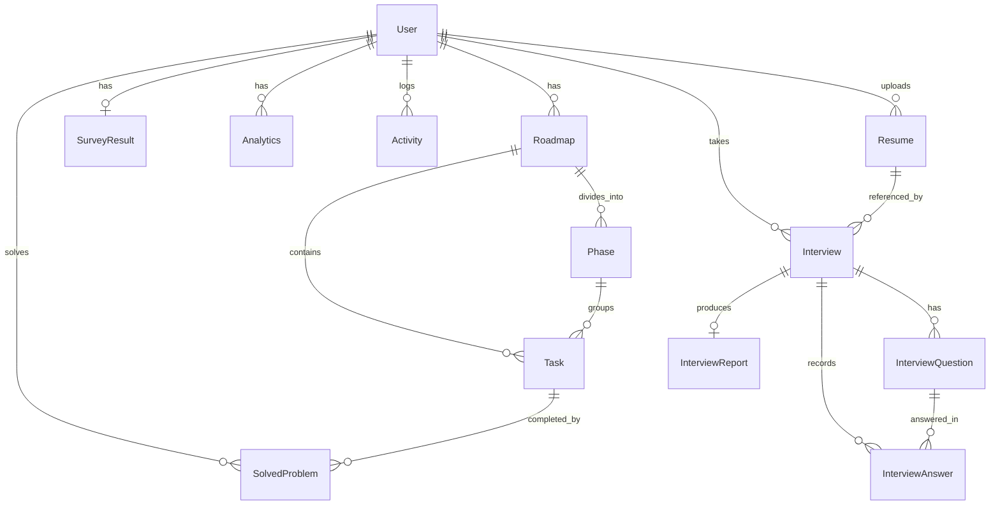

# PlacExpert AI — Complete Technical Documentation

> **Comprehensive Technical Reference & Architecture Guide** for the PlacExpert AI platform.  
> **Platform Version:** 2.0 (Full-Stack Next.js 16 + AI/ML Engine + Multi-Provider LLM Integration)

---

## Table of Contents

1. [Executive Summary & Core Value Proposition](#1-executive-summary--core-value-proposition)
2. [High-Level Architecture](#2-high-level-architecture)
3. [Technology Stack](#3-technology-stack)
4. [Project Directory & File Structure](#4-project-directory--file-structure)
5. [Database Schema (Prisma & SQLite)](#5-database-schema-prisma--sqlite)
6. [Core Modules & Frontend Features](#6-core-modules--frontend-features)
   - [6.1 Authentication & Session Management](#61-authentication--session-management)
   - [6.2 Student Profiling & Diagnostic Engine](#62-student-profiling--diagnostic-engine)
   - [6.3 Adaptive Roadmap & Progress Tracking](#63-adaptive-roadmap--progress-tracking)
   - [6.4 Dynamic Task Quiz Module](#64-dynamic-task-quiz-module)
   - [6.5 AI Mock Interview Studio](#65-ai-mock-interview-studio)
   - [6.6 End-to-End AI Interview & Report Engine](#66-end-to-end-ai-interview--report-engine)
   - [6.7 Interactive Voice Interview](#67-interactive-voice-interview)
   - [6.8 Performance Analytics & Insights Dashboard](#68-performance-analytics--insights-dashboard)
   - [6.9 Curated Learning Resources](#69-curated-learning-resources)
   - [6.10 Admin Management Portal](#610-admin-management-portal)
7. [API Route Specifications (Next.js App Router)](#7-api-route-specifications-nextjs-app-router)
8. [AI / ML & LLM Intelligence Layer](#8-ai--ml--llm-intelligence-layer)
   - [8.1 ML Readiness Classifier & Bayesian Domain Mapping (Python)](#81-ml-readiness-classifier--bayesian-domain-mapping-python)
   - [8.2 Multi-Provider LLM Service Architecture](#82-multi-provider-llm-service-architecture)
   - [8.3 Resume Ingestion & Deep Analysis](#83-resume-ingestion--deep-analysis)
   - [8.4 Adaptive Question & Grade Generation Engine](#84-adaptive-question--grade-generation-engine)
   - [8.5 Sentence Transformer Semantic Evaluation (Legacy ML)](#85-sentence-transformer-semantic-evaluation-legacy-ml)
9. [End-to-End Data & Execution Flows](#9-end-to-end-data--execution-flows)
10. [Environment Variables & Configuration](#10-environment-variables--configuration)
11. [Setup, Installation & Running Locally](#11-setup-installation--running-locally)
12. [Security, Performance & Best Practices](#12-security-performance--best-practices)

---

## 1. Executive Summary & Core Value Proposition

**PlacExpert AI** is an intelligent, full-lifecycle career guidance, placement readiness assessment, and mock interview platform tailored for software engineering and computer science students.

The platform closes the gap between standard academic coursework and real-world tech recruitment by providing:
- **Data-Driven Placement Readiness Assessment:** Combining trained XGBoost classifiers and Bayesian inference to evaluate academic records, coding problem solve counts, project portfolio depth, CS core strengths, aptitude, and communication confidence.
- **Dynamic Phased Preparation Roadmaps:** Custom day-by-day learning schedules scaled precisely to student timelines (30, 45, 60, 90, or 180 days) across 12+ specialized software roles.
- **Active Task Quizzes & Verification:** Topic-specific multiple-choice assessments generated dynamically via LLM models to verify conceptual mastery before task completion.
- **Resume-Driven Adaptive Mock Interviews:** Automated PDF/DOCX parsing extracting projects, skills, and experience to generate role-specific technical, behavioral, and architectural questions with real-time speech-to-text/audio feedback.
- **Multi-Dimensional Grading & Reporting:** Multi-agent scoring across technical correctness, relevance, clarity, completeness, and communication confidence with comprehensive visual scorecards and gap remediation plans.

---

## 2. High-Level Architecture

```
+-----------------------------------------------------------------------------------------+
|                                    CLIENT (BROWSER)                                     |
|  Next.js 16 (React 19) + TailwindCSS + Framer Motion + Recharts + Web Speech Audio Engine |
+--------------------------------------------+--------------------------------------------+
                                             |
                                HTTP / JSON Fetch / REST
                                             |
+--------------------------------------------v--------------------------------------------+
|                              NEXT.JS 16 APP ROUTER BACKEND                              |
|                                                                                         |
|  +--------------------+  +----------------------+  +----------------------------------+ |
|  | Auth & Session     |  | Roadmap & Quiz       |  | Interview & Resume Pipeline      | |
|  | - Credentials      |  | - Day advancement    |  | - Resume Parser (pdf/mammoth)    | |
|  | - Google OAuth     |  | - Task completion    |  | - Adaptive Question Generator    | |
|  | - Cookie session   |  | - AI Quiz Generator  |  | - Multi-Criteria Answer Grader   | |
|  +--------------------+  +----------------------+  +----------------------------------+ |
+---------------------+-------------------+---------------------+-------------------------+
                      |                   |                     |
           Subprocess |                   | Prisma ORM          | API Calls / Fallback
                      v                   v                     v
+-----------------------------+  +------------------+  +----------------------------------+
|   PYTHON ML SUBSYSTEM       |  |  SQLITE DATABASE |  | MULTI-PROVIDER LLM SERVICE       |
|  - predict.py (XGBoost)     |  |  (prisma/dev.db) |  | - Google Gemini 2.0 / 1.5 Flash  |
|  - Bayesian domain engine   |  |  - User          |  | - OpenAI GPT-4o-mini / GPT-4o    |
|  - sentence-transformers    |  |  - Resume        |  | - Groq Llama-3.3-70b-versatile   |
|  - advanced_analytics.pkl   |  |  - Interview     |  | - Intelligent Rule Heuristics    |
|  - readiness_model.pkl      |  |  - Roadmap & Task|  +----------------------------------+
+-----------------------------+  +------------------+
```

---

## 3. Technology Stack

### Frontend
- **Framework:** Next.js 16.2.5 (App Router, Turbopack opt-out with `--webpack` for build stability)
- **UI Library:** React 19.2.4 & React DOM 19.2.4
- **Language:** TypeScript 5.x
- **Styling:** TailwindCSS 4.x (`@tailwindcss/postcss`)
- **Animation:** Framer Motion 12.38.0
- **Data Visualization:** Recharts 3.8.1
- **Icons:** Lucide React 1.14.0
- **Utilities:** `clsx` 2.1.1, `tailwind-merge` 3.5.0
- **Audio & Speech:** Web Speech API (SpeechRecognition + SpeechSynthesis)

### Backend & API
- **API Runtime:** Next.js Serverless Route Handlers (`src/app/api/**`)
- **Legacy Backend:** Express.js 5.2.1 on port 5000 (`backend/server.js`)
- **Database ORM:** Prisma ORM 6.19.3
- **Database:** SQLite (`prisma/dev.db`)
- **Document Parsing:** `pdf-parse` 2.4.5, `pdf2json` 4.1.0, `mammoth` 1.12.3 (Word DOCX)
- **Auth Integration:** NextAuth 4.24.15 & `@auth/prisma-adapter` 2.11.3 + Custom Google OAuth Handler

### AI / ML & LLM Layer
- **Large Language Models:** Google Gemini (`gemini-2.0-flash`, `gemini-1.5-flash`), OpenAI (`gpt-4o-mini`, `gpt-4o`), Groq (`llama-3.3-70b-versatile`, `mixtral-8x7b-32768`)
- **Machine Learning (Python 3.x):**
  - `xgboost` (Placement Readiness Level Classification)
  - `scikit-learn` (Label encoders, preprocessing, pipelines)
  - `sentence-transformers` (`all-MiniLM-L6-v2` semantic cosine similarity)
  - `pandas`, `numpy`, `pickle`

---

## 4. Project Directory & File Structure

```
PlacExpert_AI/
├── src/
│   ├── app/                                 # Next.js App Router
│   │   ├── page.tsx                         # Dashboard (Server Component + DB queries)
│   │   ├── layout.tsx                       # Root HTML Layout wrapping LayoutWrapper
│   │   ├── globals.css                      # Tailwind base & global styles
│   │   ├── login/page.tsx                   # User login (Credentials + Google OAuth)
│   │   ├── signup/page.tsx                  # Registration page
│   │   ├── profiling/page.tsx               # 12-Step student diagnostic questionnaire
│   │   ├── roadmap/page.tsx                 # Dynamic roadmap viewer, tasks & quiz
│   │   ├── mock-interview/page.tsx          # Adaptive AI Mock Interview Studio
│   │   ├── ai-interview/page.tsx            # End-to-end multi-round interview & report
│   │   ├── voice-interview/page.tsx         # Voice-first interactive interview simulator
│   │   ├── analytics/page.tsx               # Performance metrics, history & radar charts
│   │   ├── resources/page.tsx               # Curated learning materials catalog
│   │   ├── admin/page.tsx                   # Admin management view
│   │   │
│   │   └── api/                             # API Endpoints
│   │       ├── auth/
│   │       │   ├── login/route.ts           # Login verification & cookie issue
│   │       │   ├── register/route.ts        # User registration
│   │       │   ├── logout/route.ts          # Cookie invalidation
│   │       │   └── google/                  # Google OAuth flow
│   │       │       ├── route.ts
│   │       │       ├── redirect/route.ts
│   │       │       └── callback/route.ts
│   │       ├── predict/route.ts             # Profiling analysis + Roadmap generation
│   │       ├── roadmap/
│   │       │   ├── route.ts                 # Roadmap retrieval & day advancement
│   │       │   ├── task/route.ts            # Task status toggle & readiness update
│   │       │   ├── solve/route.ts           # SolvedProblem log & streak computation
│   │       │   ├── questions/route.ts       # Task practice questions
│   │       │   └── exit/route.ts            # Roadmap reset
│   │       ├── quiz/
│   │       │   └── generate/route.ts        # AI / Procedural MCQ quiz generator
│   │       ├── mock-interview/
│   │       │   ├── questions/route.ts       # CSV question bank retrieval
│   │       │   ├── evaluate/route.ts        # Sentence Transformer answer evaluation
│   │       │   ├── ingest-resume/route.ts   # Resume upload & parsing
│   │       │   ├── generate-question/route.ts # Adaptive question generation
│   │       │   ├── grade-answer/route.ts    # Multi-dimensional answer grading
│   │       │   ├── save-session/route.ts    # Persist interview session history
│   │       │   └── session-summary/route.ts # Generate interview session summary
│   │       ├── resume/
│   │       │   ├── upload/route.ts          # PDF/DOCX resume file upload & extraction
│   │       │   └── analyze/route.ts         # LLM-powered resume skill & project extractor
│   │       ├── interview/
│   │       │   ├── start/route.ts           # Initialize new formal interview session
│   │       │   └── [id]/
│   │       │       ├── route.ts             # Get interview status & questions
│   │       │       ├── answer/route.ts      # Submit question answer & compute follow-up
│   │       │       ├── end/route.ts         # Conclude interview
│   │       │       └── report/route.ts      # Generate final comprehensive scorecard
│   │       ├── interviews/route.ts          # Fetch all user interviews
│   │       ├── voice/
│   │       │   ├── transcribe/route.ts      # Audio transcription endpoint
│   │       │   └── synthesize/route.ts      # Voice synthesis endpoint
│   │       └── user/route.ts                # User data endpoint
│   │
│   ├── components/                          # Reusable UI Components
│   │   ├── LayoutWrapper.tsx                # App Shell, Auth modal, Sidebar state, Streak Toast
│   │   ├── Navbar.tsx                       # Global header with user avatar & links
│   │   ├── Sidebar.tsx                      # Collapsible navigation sidebar
│   │   ├── DashboardClient.tsx              # Interactive Dashboard view
│   │   ├── AnalyticsClient.tsx              # Recharts graphs & metrics view
│   │   ├── AdminClient.tsx                  # Admin panel management interface
│   │   └── WalletConnect.tsx                # Web3 wallet connector
│   │
│   └── lib/                                 # Shared Utilities & Business Logic
│       ├── prisma.ts                        # Global PrismaClient singleton
│       ├── db-queries.ts                    # `getUserData()` database helper
│       ├── learning-streak.ts               # Streak computation from SolvedProblem logs
│       ├── llm-service.ts                   # Universal LLM caller (Gemini -> OpenAI -> Groq)
│       ├── adaptive-interview.ts            # Adaptive interview state types & grading logic
│       ├── mock-data.ts                     # Fallback sample data
│       ├── mock-interview-data.ts           # Interview domain questions & concepts
│       ├── voice-interview-data.ts          # Voice mock question datasets
│       ├── ai_interview_qa_dataset.csv      # Curated technical interview Q&A bank
│       └── interview/                       # Formal AI Interview Subsystem
│           ├── types.ts                     # Interview data models & types
│           ├── ai-provider.ts               # Resilient LLM client wrapper
│           ├── resume-analyzer.ts           # Resume NLP & extraction heuristics
│           ├── question-generator.ts        # Role & resume context question generator
│           ├── answer-evaluator.ts          # Multi-criteria scoring engine
│           └── report-generator.ts          # Scorecard & improvement plan synthesis
│
├── ml/                                      # Python Machine Learning Subsystem
│   ├── predict.py                           # XGBoost readiness prediction + Bayesian mapper
│   ├── predict_readiness.py                 # Standalone readiness script
│   ├── interview_evaluator.py               # Sentence Transformer answer similarity engine
│   ├── advanced_model.py                    # Advanced analytics trainer
│   ├── bayesian_recommendation.py           # Bayesian domain inference
│   ├── weak_area_engine.py                  # Weakness heuristic detector
│   ├── train_model.py                       # ML model training script
│   ├── train_readiness.py                   # Readiness model training script
│   ├── advanced_analytics.pkl               # Serialized XGBoost model & encoders
│   ├── readiness_model.pkl                  # Serialized readiness classifier
│   └── datasets/                            # Training data files
│
├── backend/                                 # Express.js Legacy Service (Port 5000)
│   ├── server.js                            # Express app entry
│   ├── db.js                                # Prisma client instance
│   └── constants/
│       └── roadmaps.js                      # Hardcoded template tasks for 12+ roles (147KB)
│
├── prisma/                                  # Database & Migrations
│   ├── schema.prisma                        # Prisma ORM schema
│   ├── dev.db                               # SQLite database file
│   ├── seed.ts                              # Database seed script
│   └── seedAllRolesFromRoadmapsJS.mjs       # Bulk template seeder from roadmaps.js
│
├── public/                                  # Static Assets (Logos, Icons, Illustrations)
├── student_dataset.csv                      # Primary training dataset
├── package.json                             # Dependencies & scripts
├── tsconfig.json                            # TypeScript configuration & @/ alias
├── next.config.ts                           # Next.js build settings
└── .env                                     # Environment secrets & connection strings
```

---

## 5. Database Schema (Prisma & SQLite)

The SQLite database (`prisma/dev.db`) contains 12 interconnected models managed by Prisma ORM:



### Key Models Breakdown

#### 1. `User` (Core Account & Profiling Store)
- `id`: CUID Primary Key.
- `name`, `email` (unique), `username` (unique), `phone` (unique), `password`, `image`, `role` ("USER" | "ADMIN").
- `currentDay`: Current roadmap progress day (default: 1).
- `readinessScore`: Dynamic placement readiness index (0.0 – 10.0).
- `streak`: Consecutive active days calculated from `SolvedProblem`.
- `academicYear`, `domainInterest`, `targetCompany`, `dsaCount`, `projects`, `coreCsStrength`, `codingPlatform`, `aptitude`, `communication`, `mockInterviewExp`, `codingConfidence`, `dailyStudyTime`, `preferredLang`, `placementTimeline`, `readinessLevel`, `leetcodeUsername`.

#### 2. `Resume` (Document & Parsed Profile Store)
- `id`: UUID Primary Key.
- `userId`: Foreign key -> `User` (onDelete: Cascade).
- `fileName`, `fileUrl`, `rawText`: Raw text extracted via `pdf-parse`/`mammoth`.
- `parsedData`: JSON string containing extracted name, contact, skills, education, projects, experience, internships, certifications.
- `analysis`: JSON string of strengths, technical areas, testable skills, potential questions, weak areas.

#### 3. `Interview` (Formal Assessment Session)
- `id`: UUID Primary Key.
- `userId`: Foreign key -> `User`.
- `resumeId`: Optional foreign key -> `Resume`.
- `role`: Target job role (e.g. "Full Stack Developer", "Data Scientist").
- `type`: "Technical" | "HR" | "Behavioral" | "Mixed".
- `difficulty`: "Easy" | "Medium" | "Hard".
- `mode`: "Text" | "Voice".
- `totalQuestions`: Total questions planned (default: 5).
- `currentQuestionIndex`: Current active question.
- `status`: "CREATED" | "IN_PROGRESS" | "COMPLETED" | "CANCELLED".
- `topicsCovered`: JSON array of evaluated topics.

#### 4. `InterviewQuestion` & `InterviewAnswer`
- `InterviewQuestion`: `interviewId`, `orderIndex`, `questionText`, `category` (Technical, Project, HR, Behavioral, Resume-Based), `topic`, `difficulty`, `intent`, `isFollowUp`, `reason`.
- `InterviewAnswer`: `interviewId`, `questionId`, `answerText`, `score` (0-100), `technicalCorrectness`, `relevance`, `clarity`, `completeness`, `confidence`, `feedback`, `strengths` (JSON), `weaknesses` (JSON), `knowledgeGaps` (JSON), `durationSeconds`.

#### 5. `InterviewReport` (Comprehensive Final Scorecard)
- `interviewId`: Unique foreign key -> `Interview`.
- `overallScore`, `technicalScore`, `communicationScore`, `problemSolvingScore`, `resumeKnowledgeScore`, `confidenceScore`.
- `summary`, `strengths` (JSON), `weaknesses` (JSON), `knowledgeGaps` (JSON), `resumePerformance` (JSON), `improvementSuggestions` (JSON), `preparationTopics` (JSON).

#### 6. `Roadmap`, `Phase`, `Task` & `RoadmapTemplate`
- `Roadmap`: Preparation track (`title`, `role`, `status`, `userId`).
- `Phase`: 3 structured phases per roadmap (`order`, `title`, `description`).
- `Task`: Day-by-day learning item (`day`, `dayNumber`, `category`, `status` [PENDING/COMPLETED], `type` [TOPIC/PROBLEM/MOCK], `resourceName`, `resourceLink`).
- `RoadmapTemplate`: Seeded blueprints per role (`roleName`, `dayNumber`, `title`, `category`, `resourceName`, `resourceLink`).

#### 7. `SolvedProblem`, `Analytics`, `Activity`, `Resource`, `SurveyResult`
- `SolvedProblem`: Solved task records driving streak calculations (`taskId`, `userId`, `solvedAt`, `notes`, `proofUrl`).
- `Analytics`: Historical readiness snapshots (`userId`, `date`, `metric`, `value`).
- `Activity`: Timestamped audit trail (`userId`, `action`, `status`, `timestamp`).
- `Resource`: Curated learning catalog items (`title`, `type`, `category`, `url`, `duration`, `thumbnail`, `isFeatured`).
- `SurveyResult`: Predicted role and Bayesian probability JSON from profiling.

---

## 6. Core Modules & Frontend Features

### 6.1 Authentication & Session Management
- **Routes:** `/login`, `/signup`, `/api/auth/*`
- **Supported Methods:**
  1. Standard username/email/phone & password login.
  2. Google OAuth 2.0 via `/api/auth/google`, with automatic account linking or creation.
- **Session Layer:** Stored in a browser cookie (`user_email`), valid for 30 days.
- **App Shell Security:** `LayoutWrapper.tsx` wraps all protected views. If no active session cookie is present, an animated authentication modal intercepts navigation, preventing unauthenticated access while allowing bypass on `/login`, `/signup`, and `/admin`.

### 6.2 Student Profiling & Diagnostic Engine
- **Route:** `/profiling` (Component: 12-Step Interactive Questionnaire)
- **Step Breakdown:**
  1. **Academic Year:** 1st, 2nd, 3rd, 4th Year, or Graduate.
  2. **Domain Interest:** Full Stack, Web Dev, Data Science, AI/ML, Cloud/DevOps, Mobile, Blockchain, etc.
  3. **Target Company Tier:** FAANG / Tier-1, Product Startup, Mid-tier, Service-based.
  4. **DSA Problem Solve Count:** 0–50, 50–150, 150–300, 300+.
  5. **Project Exposure:** None, Academic / Basic, Full-Stack Production, Enterprise / Open Source.
  6. **Core CS Strength:** Data Structures, DBMS & SQL, Operating Systems, Computer Networks.
  7. **Coding Platform Activity:** LeetCode, HackerRank, CodeChef, Codeforces, Never tried.
  8. **Aptitude Confidence:** Poor, Average, Good, Strong.
  9. **Communication Confidence:** Very Nervous, Nervous, Need Practice, Confident.
  10. **Mock Interview Experience:** None, 1–2 informal, 3+ formal.
  11. **Coding Confidence:** 1 (Low) to 5 (Mastery).
  12. **Daily Study Time & Timeline:** 1–2h, 2–4h, 4–6h+ across 30, 45, 60, 90, 180 Days.
- **Submission Output:** Calls `POST /api/predict`, executing Python XGBoost inference and generating an initial preparation roadmap.

### 6.3 Adaptive Roadmap & Progress Tracking
- **Route:** `/roadmap`
- **Dynamic Timeline Scaling:** Adapts 45-day master blueprints proportionally to the student's selected timeline.
- **Calendar-Based Day Advancement:** `calendarDays = floor((now - roadmapCreatedDate) / 86400000) + 1`. The platform advances `currentDay` as real-world days elapse without skipping incomplete tasks.
- **Streak Tracker:** Analyzes consecutive daily timestamps from `SolvedProblem` to award learning streak badges.
- **Task Verification:** Tasks can be marked as complete, submitted with proof URLs and reflection notes, or verified via dynamic quizzes.

### 6.4 Dynamic Task Quiz Module
- **Endpoint:** `POST /api/quiz/generate`
- **Features:**
  - Generates 5 randomized, conceptual multiple-choice questions tailored specifically to the task's subject (e.g. Binary Search, React Hooks, B-Trees, TCP Handshake).
  - Tries multi-provider LLM generation first; falls back to an extensive 120+ question procedural engine.
  - Shuffles question options ($A, B, C, D$) to eliminate answer key memorization.
  - Provides instantaneous explanations for correct and incorrect answers upon submission.

### 6.5 AI Mock Interview Studio
- **Route:** `/mock-interview`
- **Features:**
  - **Resume Ingestion:** Upload PDF, DOCX, or paste text to extract technical skills, projects, and architecture decisions.
  - **Sample Profiles:** Pre-configured profiles (Full Stack, Backend Systems, Frontend Specialist) for instant testing.
  - **Adaptive Questioning:** Generates Junior (L1), Mid (L2), or Senior (L3) questions dynamically based on student responses.
  - **Voice & Speech Recognition:** Live Web Speech API speech-to-text with auto-punctuation, microphone visualizer, and SpeechSynthesis audio readout.
  - **Deep Answer Grading:** Grades responses on Technical Correctness (0-100), Relevance, Clarity, Completeness, and Confidence.
  - **Concept Coverage Analysis:** Highlights key concepts detected vs. missing in the response.

### 6.6 End-to-End AI Interview & Report Engine
- **Route:** `/ai-interview` (Formal Multi-Round Interview Engine)
- **Pipeline:**
  1. **Resume Upload & Parsing:** Stores in DB `Resume` model, parsing text via `pdf-parse` or `mammoth`.
  2. **Session Initialization:** Creates an `Interview` record specifying role, round type (Technical, HR, Behavioral, Mixed), and difficulty.
  3. **Sequential Adaptive Q&A:** Dynamically generates questions referencing specific bullet points in the candidate's uploaded resume.
  4. **Live Evaluation:** Evaluates candidate answers via `src/lib/interview/answer-evaluator.ts`.
  5. **Final Comprehensive Scorecard (`InterviewReport`):** Calculates overall performance score, technical depth, communication score, problem-solving index, resume alignment, radar breakdown, and generated 7-day remediation plan.

### 6.7 Interactive Voice Interview
- **Route:** `/voice-interview`
- **Voice-First Experience:** Full hands-free voice mock interview simulation with speech recognition, audio waveform feedback, real-time timer, and instant spoken feedback.

### 6.8 Performance Analytics & Insights Dashboard
- **Route:** `/analytics` (Component: `AnalyticsClient.tsx`)
- **Visualizations (Recharts):**
  - Historical Readiness Score Progression (Area Chart).
  - Activity & Problem Solving Heatmap (Weekly / Monthly distributions).
  - Subject Mastery & Weakness Distribution (Bar & Radar Charts).
  - Roadmap Phase Completion Velocity.

### 6.9 Curated Learning Resources
- **Route:** `/resources`
- **Catalog:** Filterable library of curated video courses, interactive documentation, cheat sheets, and roadmap.sh guides categorized by domain (Frontend, Backend, DevOps, AI/ML, System Design, DSA).

### 6.10 Admin Management Portal
- **Route:** `/admin` (Component: `AdminClient.tsx`)
- **Capabilities:** Admin-only view to monitor registered users, total roadmap generation statistics, template seed health, and system status.

---

## 7. API Route Specifications (Next.js App Router)

| Method | Endpoint | Description | Request Body / Query | Key Response Fields |
|---|---|---|---|---|
| `POST` | `/api/auth/register` | Register new user account | `{ name, username, email, phone, password }` | `{ success, user }` (Sets cookie) |
| `POST` | `/api/auth/login` | Authenticate credentials | `{ identifier, password }` | `{ success, user }` (Sets cookie) |
| `POST` | `/api/auth/logout` | Invalidate session | None | `{ success, message }` (Clears cookie) |
| `GET` | `/api/auth/google` | Initiate Google OAuth redirect | None | HTTP 302 Redirect to Google |
| `GET` | `/api/auth/google/callback` | Google OAuth callback handler | `?code=...` | HTTP 302 Redirect to `/` |
| `POST` | `/api/predict` | Profiling evaluation & roadmap gen | Profiling answers JSON | `{ readiness, predictedRole, roadmap }` |
| `GET` | `/api/roadmap` | Fetch roadmap, streak & weak areas | Session cookie | `{ user, roadmap, weakAreas, streakInfo }` |
| `POST` | `/api/roadmap/task` | Update task status | `{ taskId, status }` | `{ success, task, newScore }` |
| `POST` | `/api/roadmap/solve` | Record problem solved for streak | `{ taskId, notes, proofUrl }` | `{ success, solvedProblem }` |
| `POST` | `/api/roadmap/questions` | Generate practice questions for task | `{ taskTitle, category }` | `{ success, questions }` |
| `POST` | `/api/quiz/generate` | Generate 5 randomized MCQs | `{ taskTitle, category }` | `{ success, source, questions }` |
| `POST` | `/api/mock-interview/ingest-resume` | Parse resume document/text | `{ resumeText, fileData }` | `{ success, profile, testableSkills }` |
| `POST` | `/api/mock-interview/generate-question` | Generate context-aware question | `{ profile, level, history }` | `{ success, question }` |
| `POST` | `/api/mock-interview/grade-answer` | Grade interview response | `{ question, answer, profile }` | `{ score, correctness, feedback, strengths }` |
| `POST` | `/api/mock-interview/session-summary` | Summarize interview session | `{ history, profile }` | `{ summary, overallScore, radarScores }` |
| `POST` | `/api/resume/upload` | Upload & extract PDF/DOCX | FormData (file) | `{ success, resumeId, parsedData }` |
| `POST` | `/api/interview/start` | Start formal interview session | `{ resumeId, role, type, difficulty }` | `{ success, interviewId, firstQuestion }` |
| `POST` | `/api/interview/[id]/answer` | Submit answer & get next question | `{ answerText, durationSeconds }` | `{ grade, nextQuestion, isCompleted }` |
| `POST` | `/api/interview/[id]/end` | Conclude interview & generate report | None | `{ success, reportId, report }` |
| `GET` | `/api/interview/[id]/report` | Retrieve final evaluation report | None | `{ report, interview, questions }` |
| `GET` | `/api/interviews` | List user interview history | Session cookie | `{ interviews }` |

---

## 8. AI / ML & LLM Intelligence Layer

### 8.1 ML Readiness Classifier & Bayesian Domain Mapping (Python)
- **Script:** `ml/predict.py`
- **Execution:** Invoked asynchronously via Node.js `child_process.spawn`.
- **Classification Engine:** Pre-trained XGBoost Classifier (`ml/advanced_analytics.pkl` / `ml/readiness_model.pkl`) trained on `student_dataset.csv`.
- **Feature Mapping:** Maps student profiling answers into encoded vectors:
  - `Academic_Year`, `DSA_Problems`, `Projects_Exposure`, `Core_CS_Strength`, `Coding_Platform`, `Aptitude_Confidence`, `Comm_Confidence`, `Coding_Confidence`, `Daily_Study_Time`.
- **Readiness Labels:**
  1. *Just Starting* (Baseline: 2.0)
  2. *Learning Basics* (Baseline: 4.0)
  3. *Actively Practicing* (Baseline: 6.0)
  4. *Ready for Interviews* (Baseline: 8.0)
- **Bayesian Domain Inference:** Calculates log-posterior probabilities $P(\text{Domain} \mid \text{Answers})$ across Web Dev, Full Stack, Data Science, AI/ML, Cloud/DevOps, and Mobile Development.

### 8.2 Multi-Provider LLM Service Architecture
- **Module:** `src/lib/llm-service.ts` & `src/lib/interview/ai-provider.ts`
- **Cascading Fallback Chain:**
  1. **Google Gemini:** `gemini-2.0-flash` -> `gemini-1.5-flash` -> `gemini-1.5-pro` (Using structured JSON response mode).
  2. **OpenAI:** `gpt-4o-mini` -> `gpt-4o`.
  3. **Groq:** `llama-3.3-70b-versatile` -> `mixtral-8x7b-32768`.
  4. **Procedural / Heuristic Rule Engine:** Instant fallback returning deterministic, structured technical assessments even when offline or in environments with missing API keys.

### 8.3 Resume Ingestion & Deep Analysis
- **Parser Pipeline:** `src/app/api/resume/upload/route.ts` & `src/lib/interview/resume-analyzer.ts`
- **Supported Formats:** PDF (`pdf-parse`, `pdf2json`), Microsoft Word (`mammoth`), Plain Text / Markdown.
- **Extracted Fields:** Candidate name, contact info, core technical skills, frameworks, databases, tools, education, work experience, project titles, architectural descriptions, metrics/impact statements.
- **Testable Skills Matrix:** Identifies candidate claims (e.g. "Distributed Caching with Redis") and produces targeted architectural inquiry hooks.

### 8.4 Adaptive Question & Grade Generation Engine
- **Modules:** `src/lib/interview/question-generator.ts` & `src/lib/interview/answer-evaluator.ts`
- **Question Generation:** Combines role expectations, candidate level, and parsed resume projects to ask probing questions (e.g., handling race conditions, indexing strategies, component lifecycle, system bottlenecks).
- **Grading Matrix:**
  - **Technical Correctness (0–100):** Accuracy of technical facts, algorithms, and complexity.
  - **Relevance (0–100):** Direct alignment with the specific question asked.
  - **Clarity (0–100):** Structure, conciseness, and articulation.
  - **Completeness (0–100):** Addressing edge cases, trade-offs, and scalability.
  - **Confidence (0–100):** Tone conviction and absence of filler phrasing.

### 8.5 Sentence Transformer Semantic Evaluation (Legacy ML)
- **Script:** `ml/interview_evaluator.py`
- **Model:** `sentence-transformers/all-MiniLM-L6-v2`
- **Mechanism:** Computes semantic cosine similarity between candidate responses and reference model answers in `INTERVIEW_BANK`, identifying mentioned vs. missing technical concepts.

---

## 9. End-to-End Data & Execution Flows

### 9.1 New User Onboarding & Roadmap Generation Flow
```
User visits / -> LayoutWrapper detects no user_email cookie -> Displays Auth Modal
  │
  ├─► User registers / logs in (or clicks Google Sign In)
  │     └─► User record created in SQLite DB -> user_email cookie set (30 days)
  │
  ├─► User redirected to / -> Dashboard detects user.domainInterest is null
  │     └─► Prompts "Complete Your Placement Profile" CTA
  │
  ├─► User navigates to /profiling and completes 12 diagnostic steps
  │     └─► Submits to POST /api/predict
  │           ├─► Spawns Python ml/predict.py (XGBoost + Bayesian Inference)
  │           ├─► Determines Predicted Role (e.g. "Python Fullstack Developer")
  │           ├─► Pulls RoadmapTemplate items, scales timeline (e.g. 45 Days)
  │           ├─► Generates Weak Area Remediation Tasks (DSA / OS / DBMS / CN)
  │           ├─► Creates Roadmap + 3 Phases + Tasks in DB
  │           └─► Sets initial readinessScore baseline
  │
  └─► Redirects to /roadmap -> Active preparation roadmap ready
```

### 9.2 Daily Task Execution & Streak Tracking Flow
```
User visits /roadmap
  │
  ├─► GET /api/roadmap runs:
  │     ├─► Computes Calendar Days elapsed since roadmap creation
  │     ├─► Advances currentDay if calendar > DB currentDay
  │     ├─► Computes streak by checking consecutive daily timestamps in SolvedProblem
  │     └─► Analyzes weak areas from profiling answers
  │
  ├─► User opens a task:
  │     ├─► Reads linked resource (documentation / video / tutorial)
  │     ├─► Clicks "Take Verification Quiz" -> POST /api/quiz/generate generates 5 MCQs
  │     └─► Submits quiz -> Answers graded instantly with explanations
  │
  └─► User marks task COMPLETED:
        ├─► POST /api/roadmap/task updates Task status in DB
        ├─► Recalculates user readinessScore: baseline + (completed/total) * (10 - baseline)
        ├─► POST /api/roadmap/solve logs SolvedProblem record -> increments streak
        └─► Creates Activity and Analytics snapshot records
```

### 9.3 Resume-Based AI Mock Interview Flow
```
User visits /mock-interview or /ai-interview
  │
  ├─► User uploads resume (PDF / DOCX) or pastes profile
  │     └─► POST /api/resume/upload or /api/mock-interview/ingest-resume
  │           └─► Extracts text, skills, projects, and architecture hooks
  │
  ├─► User selects Target Role & Difficulty -> Starts session
  │     └─► POST /api/interview/start creates Interview record
  │           └─► Generates Question #1 tailored to candidate's resume project
  │
  ├─► Candidate answers question via voice (Speech-to-Text) or text input
  │     └─► POST /api/interview/[id]/answer
  │           ├─► Calls LLM (Gemini / OpenAI / Groq) with multi-criteria rubric
  │           ├─► Stores InterviewAnswer with individual metrics & feedback
  │           └─► Generates adaptive follow-up or next technical question
  │
  └─► All questions completed:
        └─► POST /api/interview/[id]/end synthesizes InterviewReport
              ├─► Overall Score, Radar Metrics, Strengths & Weaknesses
              └─► Generates tailored 7-Day Improvement Roadmap
```

---

## 10. Environment Variables & Configuration

Create a `.env` file in the root directory:

```env
# Database Connection (SQLite)
DATABASE_URL="file:./dev.db"

# LLM Provider API Keys (At least one recommended for dynamic generation)
GEMINI_API_KEY="your-gemini-api-key"
GOOGLE_API_KEY="your-google-api-key"
OPENAI_API_KEY="your-openai-api-key"
GROQ_API_KEY="your-groq-api-key"

# Google OAuth Credentials (For Google Sign-In)
GOOGLE_CLIENT_ID="your-google-client-id.apps.googleusercontent.com"
GOOGLE_CLIENT_SECRET="your-google-client-secret"
NEXT_PUBLIC_APP_URL="http://localhost:3000"

# NextAuth Secret (Optional session secret)
NEXTAUTH_SECRET="your-random-nextauth-secret-key"
NEXTAUTH_URL="http://localhost:3000"
```

---

## 11. Setup, Installation & Running Locally

### Prerequisites
- **Node.js:** v18.18+ or v20+
- **Python:** 3.9+ with `pip`
- **npm** or **pnpm**

### 1. Clone & Install Dependencies
```powershell
# Navigate to project root
cd e:\VSCODE\PlacExpert_AI

# Install Node dependencies
npm install

# Install Python ML requirements
pip install xgboost scikit-learn pandas numpy sentence-transformers
```

### 2. Initialize Database & Seed Templates
```powershell
# Generate Prisma Client
npx prisma generate

# Apply database schema
npx prisma db push

# Seed Roadmap Templates & Role Blueprints
node prisma/seedAllRolesFromRoadmapsJS.mjs
```

### 3. Run Development Server
```powershell
# Run Next.js with Webpack bundler
npm run dev
```
Open **http://localhost:3000** in your browser.

### 4. Optional / Utility Commands
```powershell
# Inspect database with Prisma Studio GUI
npx prisma studio
# Accessible at http://localhost:5555

# Run standalone Express backend (legacy service)
cd backend
node server.js
# Runs on http://localhost:5000
```

---

## 12. Security, Performance & Best Practices

| Domain | Implementation & Recommendations |
|---|---|
| **Bundler Stability** | Configured with `next dev --webpack` to eliminate Next.js 16 Turbopack memory cache corruption during hot module reloading. |
| **LLM Resilience** | Multi-tier cascading fallback (Gemini -> OpenAI -> Groq -> Procedural Engine) guarantees 100% uptime for quizzes, interview grading, and report generation even during API outages or rate limits. |
| **Document Ingestion** | Multiple PDF parser fallbacks (`pdf-parse`, `pdf2json`, `mammoth` for DOCX) ensure smooth parsing across various resume templates. |
| **Database Transactions** | Prisma atomic transactions are used when regenerating roadmaps and logging interview answers to ensure data consistency. |
| **Authentication Cookies** | Session managed via `user_email` cookie with 30-day persistence. For production deployments, migrate to encrypted JWTs / NextAuth session tokens with `httpOnly: true`, `secure: true`, and `SameSite=Strict`. |
| **Password Storage** | Current local development stores plain text credentials for testing speed. For production environments, integrate `bcryptjs` or `argon2` password hashing before persisting user records. |
